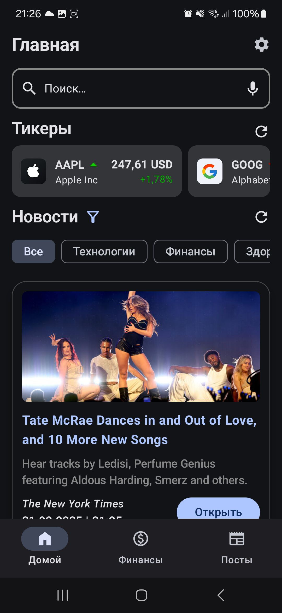
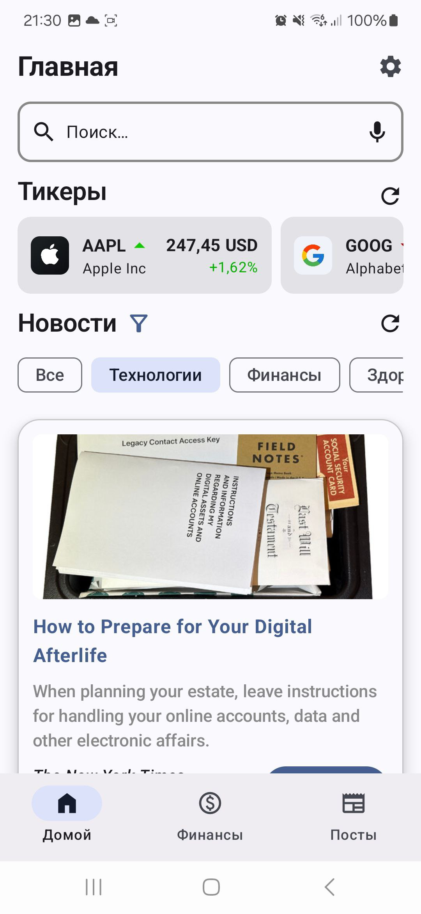
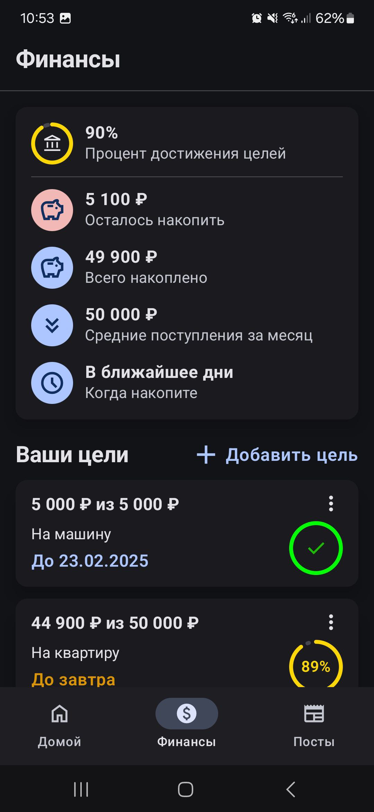
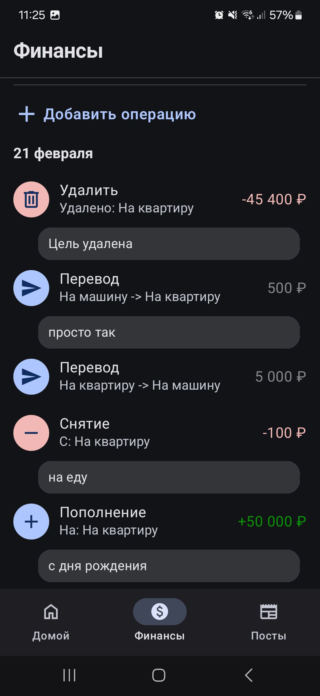
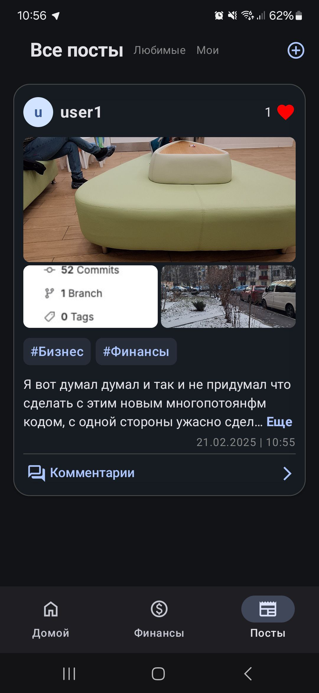
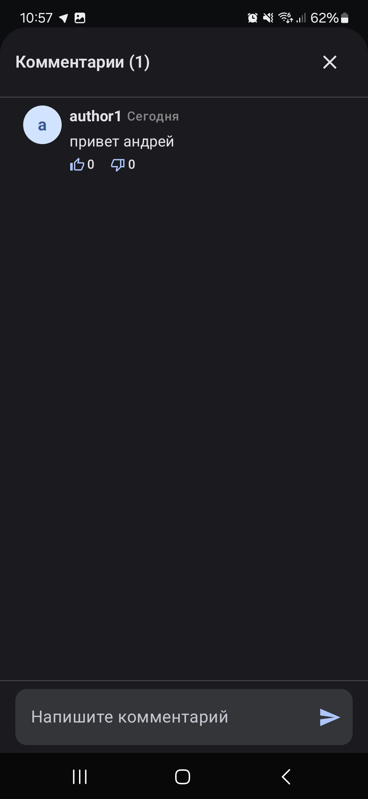
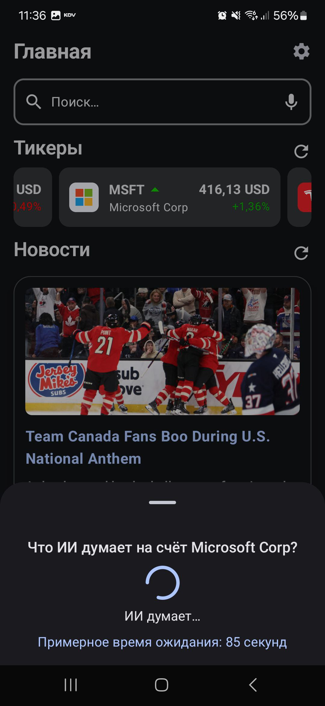
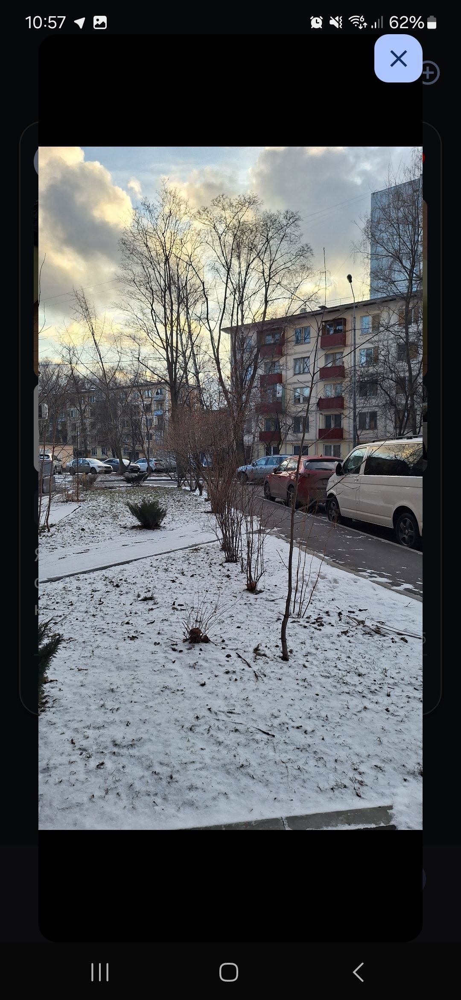

# SuperFinancer
SuperFinancer – это приложение для тех, кто интересуется деньгами и всем, что с этим связано.

# Сборка

- Склонируйте репозиторий

```bash
git clone https://gitlab.prodcontest.ru/2025-final-projects-mobile/PotaninPM.git
```
- Создайте файл `local.properties` в корне проекта и запишите в него локацию SDK

```properties
sdk.dir=/.../.../Android/Sdk
```

- Можете запускать!
При сборке релизной версии приложения применяется обфускация, настроенная в gradle модуля `app` (`isMinifyEnabled`).

### Архитектура:

Приложение построено на основе Clean Architecture с использованием паттерна feature modules и архитектуры MVVM.

## Clean Architecture

- Разделяет код на независимые слои для упрощения разработки.
- Упрощает тестирование

## Feature modules

- Каждая функциональность выделена в отдельный модуль, что способствует масштабируемости и удобству разработки.
- Изменение одной фичи не требует пересборки всего проекта.

## MVVM

- Отделяет логику отображения от бизнес-логики, обеспечивая разделение ответственности и облегчая работу с UI.

## Структура проекта

- `app` -  основной модуль приложения, в котором настраиваются фреймворки Koin и Jetpack Navigation.
- `common` - общие компоненты и функции приложения
- `feature_home` - модуль, содержащий главный экран и функциональность поиска.
- `feature_finances` - модуль с финансовым помощником для управления сбережениями и целями.
- `feature_feed` - модуль для функционала социальной сети, включая посты и ленту.

Многомодульная архитектура была выбрана для упрощения тестирования, поддержки, разделения ответственности, читаемости. Также использование такого подхода в разы увеличивает скорость сборки приложения. Все фичи разделены на data, domain и presentation, что разделяет ответственность на логические участки кода. Это помогает при тестировании и поддержке.

# Реализованные дополнительные фичи:

### Главная страница:
<div style="display: flex; flex-wrap: wrap;">
    
    
</div>

1. PullToRefresh на главной странице.
2. Шиммер во время загрузки главной, поиска.
3. Пагинация в Поиске для новостей.
4. Добавлен срок актуальности данным в кэше. Кэш считается актуальным только в течение 6 часов (в противном случае получаем заново с сервера).
5. Локальный конфиг тикеров вынес в ремоут хранилище (Supabase - opensource аналог Firebase).
6. Обновление тикеров кнопкой либо настройка автообновления раз в N секунд (кнопка настроек на главной странице).
7. Работает голосовой ввод в поиске.
8. Категории - при нажатии на иконку фильтра рядом с `Новости` появляется список категорий, при выборе которых происходит фильтрация новостей.
### Финансы:
<div style="display: flex; flex-wrap: wrap;">
    
    
</div>

1. Менеджер счетов (переводы между счетами, снятие со счетов).
2. Отображается дополнительно: Сколько осталось времени до достижения всех целей, средние поступления за месяц, сколько осталось копить (денег).
3. Если цель уже прошла или до нее остался 1 день то появляется определенный текст в дате и она окрашивается в другой цвет.
### Лента:
<div style="display: flex; flex-wrap: wrap;">
    
    
</div>

1. Функциональность профиля и отображения авторов постов. Плюс сюда же функицонал с комментариями под постами(все локально).
2. Система отображения фотографий(до 4 включая в особом виде, дальше как горизонтальный список).
3. Текст ограничен 3мя строками. Если текст больше, то появляется кнопка "Еще" и раскрывает весь пост, а также появляется кнопка "скрыть", которая обратно возвращает состояние текста.
4. Добавлен раздел `Мои` для просмотра созданных тобой постов, а также для переключения между разделами используется Horizontal Pager.
### Общие:
<div style="display: flex; flex-wrap: wrap;">
    
    
</div>

1. Добавлена нейросеть(`meta-llama/llama-3.3-70b-instruct`) для анализа финасового состояния кампании (при нажатии на тикер bottom sheet появляется), так же если зажать текст который она выдала можно скопировать его в буфер обмена. (работает как на главной так и в поиске).
2. Возможность открывать картинки в любом месте приложения в полный размер(при нажатии на них).
3. Добавлен сбор аналитики по действиям пользователя (локальные логи).

#### Про работу в репозитории

При написании сообщений к коммитам использовался [Conventional Commits](https://www.conventionalcommits.org/en/v1.0.0/)
